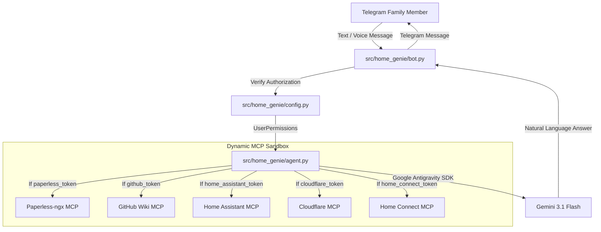

# 🏗 Architecture Overview

Home Genie uses a multi-tenant, decoupled architecture built around the **Google Antigravity SDK**, **Async Telegram Bot**, and **Model Context Protocol (MCP)** sandboxes.

---

## 🔒 Security & Multi-Tenant RBAC

Home Genie isolates user credentials and capabilities at the LLM prompt level:

1. **Per-User Permissions (`UserPermissions`)**:
   Each family member is identified by their Telegram User ID in the `FAMILY_USERS` JSON configuration.

2. **Dynamic Capability Sandboxing**:
   When a user sends a query, `build_mcp_servers_for_user()` constructs an MCP server list containing **only** the services for which that user has valid tokens configured.

3. **Subprocess Isolation**:
   Secrets (e.g. `TELEGRAM_BOT_TOKEN`, `GEMINI_API_KEY`, or other users' tokens) are stripped from the environment before spawning child MCP subprocesses.
